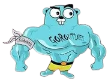

<link rel="stylesheet" type='text/css' href="https://cdn.jsdelivr.net/gh/devicons/devicon@latest/devicon.min.css" />

  

<h1 align="center" style="margin-top: -35px;">
  Bem-vindo!!!🌵
</h1>

  

 
  Tenho <b>16 anos</b>, moro em <b>São Paulo</b> e estudo no <b>ensino médio</b>. Também estou cursando <b>Desenvolvimento de Sistemas</b> na <b>ETEC Camargo Aranha</b>. 🎓 
  Atualmente estudo <b>Golang</b> e <b>Java</b> por fora da ETEC, com conhecimento básico em <b>Python</b> e <b>Java</b>. 
  Meu foco principal é o <b>desenvolvimento backend</b> com Go! 🔥

  

  
  
  
  
  
  

  &nbsp;&nbsp;&nbsp;&nbsp;
  
  &nbsp;&nbsp;&nbsp;&nbsp;
  

  <h2>📊 Minhas Estatísticas</h2>
  
    
  
    
  

 

  <h2>Contribuições</h2>
  

 

  <h2>Skills</h2>
  <table align="center">
    <tr>
      <td align="center" width="160">
        <b>Golang</b> 
        
         ⭐⭐⭐⭐
      </td>
      <td align="center" width="160">
        <b>Java</b> 
        
         ⭐⭐⭐
      </td>
      <td align="center" width="160">
        <b>JavaScript</b> 
        
         ⭐⭐⭐
      </td>
    </tr>
    <tr>
      <td align="center" width="160">
        <b>HTML</b> 
        
         ⭐⭐⭐
      </td>
      <td align="center" width="160">
        <b>CSS</b> 
        
         ⭐⭐⭐
      </td>
      <td align="center" width="160">
        <b>Git</b> 
        
         ⭐⭐⭐⭐
      </td>
      <td align="center" width="160">
        <b>GitHub</b> 
        
         ⭐⭐⭐⭐
      </td>
    </tr>
  </table>

  <h2>Entre em contato comigo</h2>
  &nbsp;
  &nbsp;
  &nbsp;
  

 

  

